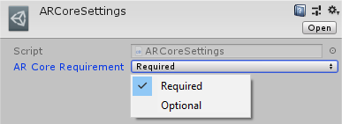
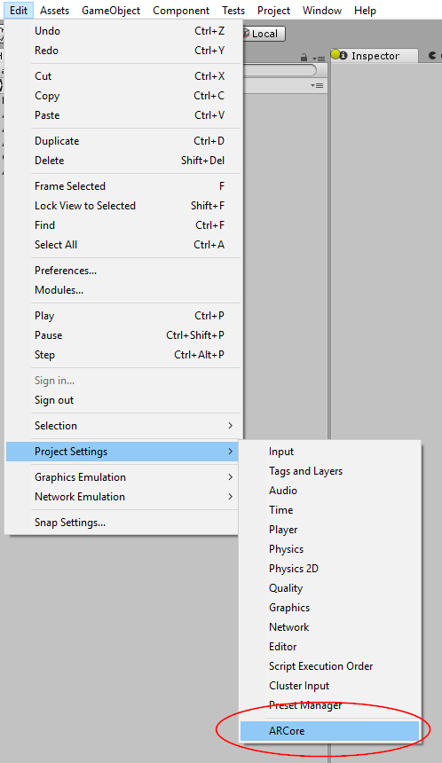
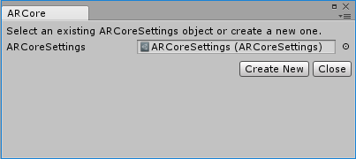

# About ARCore XR Plugin

Use the *ARCore XR Plugin* package enable ARCore support via Unity's multi-platform XR API. This package implements the following XR Subsystems:

* [Camera](https://docs.unity3d.com/2018.1/Documentation/ScriptReference/Experimental.XR.XRCameraSubsystem.html)
* [Depth](https://docs.unity3d.com/2018.1/Documentation/ScriptReference/Experimental.XR.XRDepthSubsystem.html)
* [Input](https://docs.unity3d.com/2018.1/Documentation/ScriptReference/Experimental.XR.XRInputSubsystem.html)
* [Planes](https://docs.unity3d.com/2018.1/Documentation/ScriptReference/Experimental.XR.XRPlaneSubsystem.html)
* [Raycast](https://docs.unity3d.com/2018.1/Documentation/ScriptReference/Experimental.XR.XRRaycastSubsystem.html)
* [ReferencePoints](https://docs.unity3d.com/2018.1/Documentation/ScriptReference/Experimental.XR.XRReferencePointSubsystem.html)
* [Session](https://docs.unity3d.com/2018.1/Documentation/ScriptReference/Experimental.XR.XRSessionSubsystem.html)

This version of *ARCore XR Plugin* supports only the functionality available as of ARCore 1.2:

* Device Localization
* Horizontal Plane Detection
* Vertical Plane Detection
* Point Clouds
* Pass-through Camera View
* Light Estimation
* Reference Points
* Oriented Feature Points
* Hit Testing
* Session Management
* ARCore Apk On-Demand Installation

# Installing ARCore XR Plugin

To install this package, follow the instructions in the [Package Manager documentation](https://docs.unity3d.com/Packages/com.unity.package-manager-ui@latest/index.html).

In addition, you will likely want to also install the *AR Foundation* package which makes use of *ARCore XR Plugin* package and provides many useful scripts and prefabs.

For more information on the *AR Foundation* package, please read the [AR Foundation Documentation](https://docs.unity3d.com/Packages/com.unity.xr.arfoundation@1.0/api/UnityEngine.XR.ARFoundation.html).

# Using ARCore XR Plugin

The *ARCore XR Plugin* implements the native endpoints required for building Handheld AR apps using Unity's multi-platform XR API. However, this package does not expose any public scripting interface of its own and most developers should use the scripts, prefabs, and assets provided by *AR Foundation* as the basis for their Handheld AR apps.

Inclusion of the *ARCore XR Plugin* will result in the inclusion of source files, static libraries, shader files, and plugin metadata.

## Build Settings

ARCore may be either "required" or "optional". If ARCore is optional, the Play Store will allow your app to be installed on a device that does not support ARCore, or where ARCore may be supported but not installed. This is useful if you want to provide an experience which uses AR where available, and presents a different experience where AR is not available. By default, AR is required.

To create an `ARCoreSettings` asset and assign it to your build settings, click Edit > Project Settings > ARCore

This window will let you choose the `ARCoreSettings` asset to use for the build:

# Technical details
## Requirements

This version of *ARCore XR Plugin* is compatible with the following versions of the Unity Editor:

* 2018.1 and later (recommended)

## Known limitations

* Multi-threaded rendering is not presently supported.
* The *AR Core Supported* checkbox in the XR Settings section of the Android Player settings must remain unchecked in order for apps built with the *ARCore XR Plugin* to work properly.
* Color Temperature in degrees Kelvin is not presently supported. 

## Package contents

This version of *ARCore XR Plugin* includes:

* A shared library which provides implementation of the XR Subsystems listed above
* A shader used for rendering the camera image
* A plugin metadata file

## Document revision history
|Date|Reason|
|---|---|
|April 19, 2018|Documentation update.|
|June 1, 2018|Add documentation and screenshots for ARCore build settings. Remove incorrect reference to Xcode and iOS.|
|June 7, 2018|<ul><li>Change reference from *Player Settings* to *Project Settings*</li><li>Change reference from *AR Utilities* to *AR Foundation*</li></ul>|
|June 11, 2018|<ul><li>Add link to AR Foundation documentation in Installing ARCore Plugin</li><li>Changed arcore_settings photo to reflect most recent changes</li></ui>|
